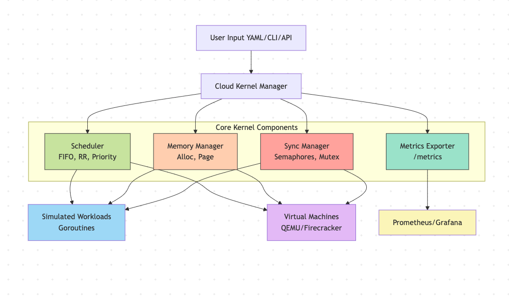

# ☁️ CKM: Cloud Kernel Manager

> A modular kernel simulation framework for managing both simulated processes and virtual machines using real OS principles — with full DevOps-style observability.
>
> ## What Is CKM?

**Cloud Kernel Manager (CKM)** is a hybrid cloud-native project that:

CKM is designed to:
-  Simulate core OS behaviors: scheduling, memory, synchronization
-  Manage both lightweight tasks and full virtual machines
-  Export Prometheus-compatible metrics for real-time observability

---

## Features Overview

| Component          | Description                                                          |
|--------------------|----------------------------------------------------------------------|
| **CPU Scheduling**   | Pluggable schedulers: FIFO, Round Robin, Fair, and Multilevel      |
| **Dynamic Selection**| Scheduler auto-selects based on task mix (e.g., `.ipynb`, `.vm`)   |
| **Memory Management**| Simulated allocation, tracking, paging support (planned)           |
| **Synchronization** | Simulation of mutex, semaphores, and deadlock detection (planned)   | 
| **Workload Modeling**| Unified struct for scripts, VMs, containers, notebooks             |
| **Metrics Exporter**| Prometheus `/metrics` endpoint (e.g., memory, workload count)       |
| **VM Integration**  | Optional: QEMU-based VM launcher (Firecracker support planned)      |
| **YAML Configuration**| Task, VM, and resource definitions via YAML                       |
| **Grafana Dashboard**| Optional dashboard via `grafana-dashboard.json`                    |

---

### Built for learners, operators, and anyone wanting to master the intersection of OS concepts and cloud infrastructure.

## Architecture and Design

