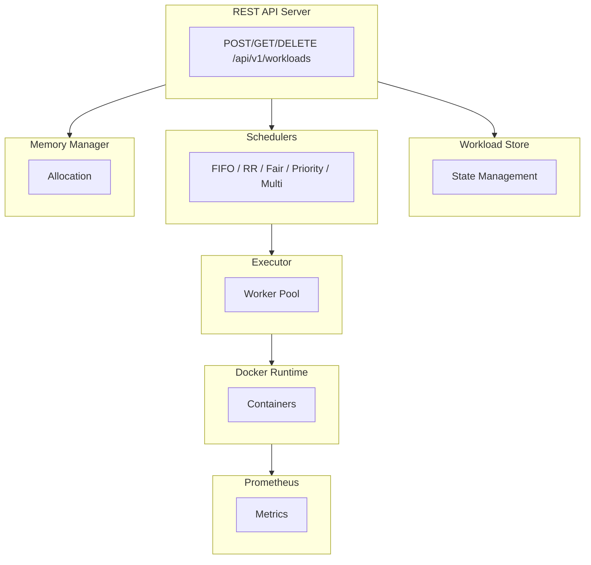

# ☁️ CKM: Cloud Kernel Manager

> A production-ready workload orchestration system demonstrating kernel concepts, OS internals, load balancing, and SRE practices — with real Docker container execution and comprehensive observability.

## What Is CKM?

**Cloud Kernel Manager (CKM)** is a cloud-native workload orchestration system that:

- Executes real Docker containers with resource limits
- Implements OS kernel concepts: scheduling, memory management, process groups
- Provides production-grade observability with Prometheus & Grafana
- Demonstrates SRE patterns: circuit breakers, rate limiting, graceful shutdown

---

## Architecture



---

## Features

| Component | Description |
|-----------|-------------|
| **REST API** | Full CRUD for workload management |
| **Docker Runtime** | Execute real containers with resource limits |
| **Schedulers** | FIFO, Round-Robin, Fair, Priority, Multilevel |
| **Memory Manager** | Track and limit memory allocation |
| **Process Management** | Process groups, sessions, parent-child relationships |
| **Signal Handling** | Graceful shutdown with SIGTERM/SIGINT |
| **cgroups-like Limits** | CPU shares and memory limits |
| **Circuit Breaker** | Prevent cascading failures |
| **Rate Limiting** | Token bucket algorithm |
| **Load Balancer** | Round-robin, least-connections, weighted |
| **Prometheus Metrics** | Comprehensive observability |
| **Grafana Dashboards** | Visualize workloads, schedulers, resources |

---

## Quick Start

### Prerequisites

- Go 1.24+
- Docker
- Docker Compose (optional)

### Run Locally

```bash
# Clone the repository
git clone https://github.com/yourusername/ckm.git
cd ckm

# Install dependencies
go mod tidy

# Run the server
go run cmd/kernel_main.go
```

### Run with Docker Compose

```bash
# Start all services (CKM, Prometheus, Grafana)
docker-compose up -d

# View logs
docker-compose logs -f ckm

# Access services
# - API: http://localhost:8080
# - Prometheus: http://localhost:9091
# - Grafana: http://localhost:3000 (admin/admin)
```

---

## API Reference

### Create Workload

```bash
curl -X POST http://localhost:8080/api/v1/workloads \
  -H "Content-Type: application/json" \
  -d '{
    "id": "my-workload",
    "type": "container",
    "memory_mb": 256,
    "image": "alpine:latest",
    "command": ["echo", "Hello World"],
    "priority": 1
  }'
```

### List Workloads

```bash
curl http://localhost:8080/api/v1/workloads
```

### Get Workload Status

```bash
curl http://localhost:8080/api/v1/workloads/my-workload
```

### Delete Workload

```bash
curl -X DELETE http://localhost:8080/api/v1/workloads/my-workload
```

### Health Check

```bash
curl http://localhost:8080/api/v1/health
```

---

## Metrics

Prometheus metrics are available at `http://localhost:9090/metrics`:

| Metric | Type | Description |
|--------|------|-------------|
| `ckm_workloads_running_total` | Gauge | Currently running workloads |
| `ckm_workloads_completed_total` | Counter | Completed workloads by type |
| `ckm_workload_duration_seconds` | Histogram | Execution duration by type |
| `ckm_workload_failures_total` | Counter | Failures by type and reason |
| `ckm_memory_usage_megabytes` | Gauge | Memory usage |
| `ckm_scheduler_queue_length` | Gauge | Scheduler queue depth |
| `ckm_container_startup_time_seconds` | Histogram | Container startup latency |

---

## Project Structure

```
ckm/
├── cmd/
│   └── kernel_main.go       # Main entry point
├── configs/
│   └── workloads.yaml       # Sample workload config
├── deployments/
│   ├── prometheus.yml       # Prometheus configuration
│   ├── grafana-dash.json    # Grafana dashboard
│   └── grafana-*.yml        # Grafana provisioning
├── internal/
│   ├── api/
│   │   └── server.go        # REST API server
│   ├── balancer/
│   │   └── load_balancer.go # Load balancer
│   ├── common/
│   │   ├── config.go        # Configuration loading
│   │   ├── logger.go        # Structured logging
│   │   ├── metrics.go       # Prometheus metrics
│   │   ├── circuit_breaker.go
│   │   └── rate_limiter.go
│   ├── kernel/
│   │   ├── scheduler.go     # Scheduler interface & workload
│   │   ├── fifo.go          # FIFO scheduler
│   │   ├── round_robin.go   # Round-robin scheduler
│   │   ├── fair_scheduler.go
│   │   ├── priority_scheduler.go
│   │   ├── multilevel_scheduler.go
│   │   ├── memory.go        # Memory manager
│   │   ├── store.go         # Workload store
│   │   ├── executor.go      # Workload executor
│   │   ├── process.go       # Process management
│   │   ├── signals.go       # Signal handling
│   │   └── cgroups.go       # Resource limits
│   └── runtime/
│       └── docker.go        # Docker runtime
├── Dockerfile               # Multi-stage build
├── docker-compose.yml       # Local development stack
├── go.mod
└── README.md
```

---

## Configuration

### Environment Variables

| Variable | Default | Description |
|----------|---------|-------------|
| `ENV` | `production` | Environment (`development` for colored logs) |

### Workload YAML

```yaml
- id: "task-001"
  cpu_time: "2s"
  memory_mb: 256
  file_path: "jobs/train.py"
```

---

## Testing

### Run Unit Tests

```bash
go test ./...
```

### Run Integration Tests (requires Docker)

```bash
go test -tags=integration ./...
```

### Run with Coverage

```bash
go test -cover ./...
```

---

## Scheduler Algorithms

### FIFO (First-In-First-Out)
Executes workloads in order of arrival. Simple but may cause starvation.

### Round-Robin
Executes workloads in time slices (quantum). Fair but may have overhead.

### Fair Scheduler
Prioritizes workloads with least total runtime. Prevents starvation.

### Priority Scheduler
Executes workloads by priority (lower number = higher priority).

### Multilevel Scheduler
Routes different workload types to different schedulers (VMs vs tasks).

---

## SRE Patterns Implemented

### Circuit Breaker
Prevents cascading failures by stopping requests when a service is failing.
- States: Closed (normal), Open (failing), Half-Open (testing)
- Configurable failure threshold and timeout

### Rate Limiter
Controls request rate using token bucket algorithm.
- Configurable rate (tokens/second) and capacity
- Blocks or rejects excess requests

### Graceful Shutdown
Handles SIGTERM/SIGINT for clean shutdown.
- Waits for running workloads to complete
- Shuts down API server gracefully

---

## Development

### Add New Scheduler

1. Create `internal/kernel/my_scheduler.go`
2. Implement `Scheduler` interface:

```go
type Scheduler interface {
    Add(Workload)
    Run()
}
```

3. Add to `ChooseScheduler()` in `scheduler.go`

### Add New Metrics

1. Define in `internal/common/metrics.go`
2. Register in `InitMetrics()`
3. Update Grafana dashboard

---

## Contributing

1. Fork the repository
2. Create feature branch: `git checkout -b feature/my-feature`
3. Commit changes: `git commit -am 'Add feature'`
4. Push branch: `git push origin feature/my-feature`
5. Submit Pull Request

---

## License

MIT License - see LICENSE file for details.

---

## Acknowledgments

This project demonstrates concepts from:
- Operating Systems (scheduling, memory management, process management)
- Site Reliability Engineering (observability, resilience patterns)
- Cloud Native (containers, orchestration, metrics)

Built for learning and demonstrating understanding of kernel, OS, load balancing, and SRE concepts.
