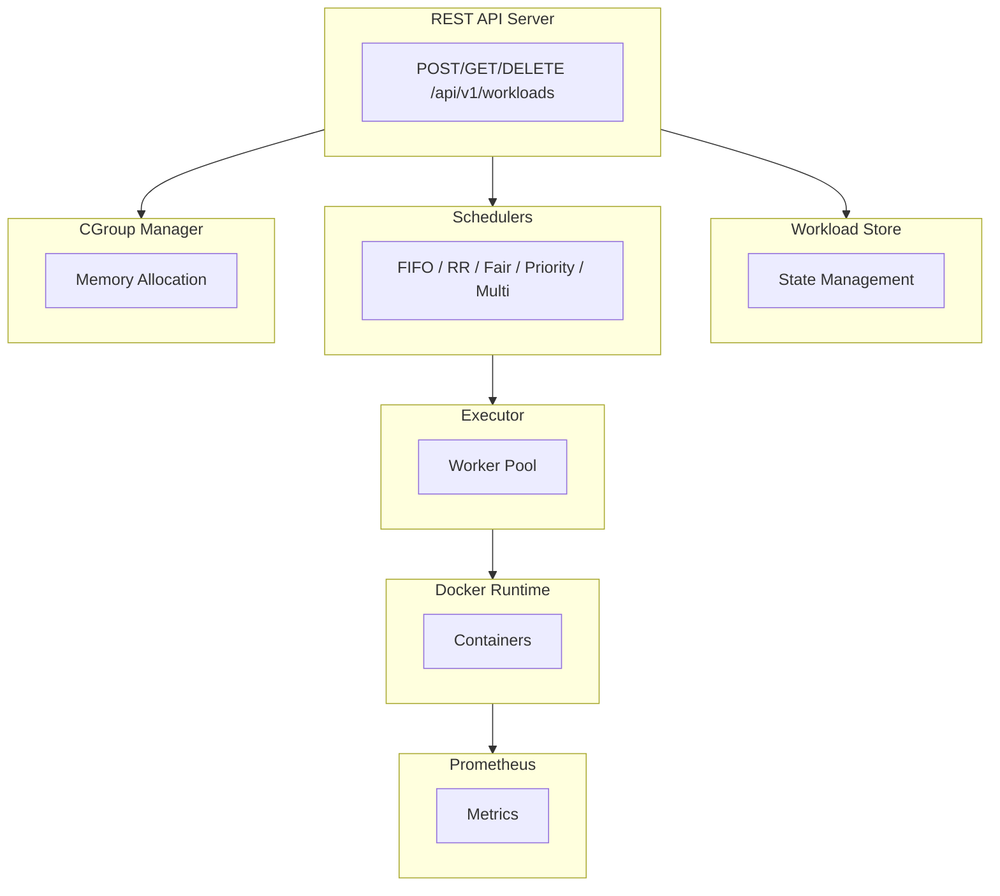

# CKM

[](https://go.dev/)
[](https://www.docker.com/)
[](https://prometheus.io/)
[](https://grafana.com/)
[](LICENSE)
[]()

A workload orchestration system I built to understand how kernel scheduling, memory management, and production infrastructure come together in real-world systems.

**Tech Stack:** Go 1.24+ | Docker SDK | Gorilla Mux | Prometheus | Zap Logging | Grafana

---

## Background

I'm a final year CS student, and I've always been curious about how things work under the hood. In my OS classes, we learned about scheduling algorithms like FIFO and Round-Robin, but everything felt theoretical. When I was learning cloud computing and cloud environments, I studied containers, metrics, and load balancing, but I never really understood how these pieces connect.

So I decided to build something that bridges both worlds.

CKM started as a simple scheduler simulation, but I kept asking myself: *"How would this actually work in production?"* That question led me down a rabbit hole of learning about:

- How schedulers decide which workload runs next and why it matters for different application types
- Why metrics like queue depth and execution latency are crucial for understanding system behavior
- How production systems handle failures gracefully without taking down everything
- The relationship between OS-level resource limits (cgroups) and container orchestration

The result is this project. Not just a toy simulation, but something that actually runs Docker containers, collects real metrics, and handles workloads like a simplified version of what Kubernetes does internally.

---

## What I Learned

### Scheduling Isn't Just an Algorithm

In textbooks, scheduling is about choosing the "best" algorithm. But in practice, the right scheduler depends on your workload:

- **Interactive apps** like Jupyter notebooks need low latency, so Fair Scheduler works well here
- **Batch jobs** like ML training and data processing can tolerate waiting, so Priority Scheduler makes sense
- **Mixed workloads** need multilevel scheduling to avoid starving one type

I implemented all of these and connected them to metrics so I could actually *see* the difference in Grafana. Watching queue depth spike when using the wrong scheduler for a workload type was eye-opening.

### Metrics Tell the Story

Before this project, I thought metrics were just "nice to have." Now I understand they're essential for understanding what's happening inside a system:

- `ckm_workload_duration_seconds` tells me if jobs are taking longer than expected
- `ckm_scheduler_queue_length` shows backpressure before it becomes a problem
- `ckm_container_startup_time_seconds` helps identify infrastructure issues

These aren't random numbers. Each metric answers a specific question about system behavior.

### Production Systems Are About Failure

The most valuable part of this project was implementing resilience patterns:

- **Circuit Breaker**: I finally understand why Netflix built Hystrix. When one service fails, you need to stop hammering it.
- **Rate Limiting**: Token bucket algorithm seemed abstract until I implemented it and saw how it smooths out traffic spikes.
- **Graceful Shutdown**: SIGTERM handling isn't optional in production. Containers get killed, and you need to clean up properly.

---

## Architecture



---

## Features

| Component | What It Does | Why It Matters |
|-----------|--------------|----------------|
| **REST API** | CRUD for workloads | Real systems need APIs, not just CLI |
| **Docker Runtime** | Executes actual containers | Moves beyond simulation to real workloads |
| **Schedulers** | 5 different algorithms | Different workloads need different strategies |
| **CGroup Manager** | Tracks memory allocation with cgroup-like limits | Prevents OOM and resource starvation |
| **Process Management** | Groups, sessions, parent-child | Mirrors how Linux actually manages processes |
| **cgroups-like Limits** | CPU/memory constraints | Same concepts Docker uses internally |
| **Circuit Breaker** | Stops cascading failures | Essential for distributed systems |
| **Rate Limiter** | Controls request flow | Prevents overload during traffic spikes |
| **Prometheus Metrics** | Observability | Can't fix what you can't measure |
| **Grafana Dashboards** | Visualization | Makes metrics actionable |
| **Container Discovery** | Monitors ALL Docker containers | See any app's performance without setup |

---

## Quick Start

### Prerequisites

- Go 1.24+
- Docker
- Docker Compose (optional, but makes life easier)

### Run Locally

```bash
git clone https://github.com/enesyesil/ckm.git
cd ckm

go mod tidy
go run cmd/kernel_main.go
```

### Run with Docker Compose

```bash
# Starts CKM, Prometheus, and Grafana
docker-compose up -d

# Check logs
docker-compose logs -f ckm

# Access:
# - API: http://localhost:8080
# - Prometheus: http://localhost:9091
# - Grafana: http://localhost:3001 (admin/admin)
```

---

## API

### Create a Workload

```bash
curl -X POST http://localhost:8080/api/v1/workloads \
  -H "Content-Type: application/json" \
  -d '{
    "id": "my-job",
    "type": "container",
    "memory_mb": 256,
    "image": "alpine:latest",
    "command": ["echo", "hello world"],
    "priority": 1
  }'
```

### Check Status

```bash
curl http://localhost:8080/api/v1/workloads/my-job
```

### List All

```bash
curl http://localhost:8080/api/v1/workloads
```

### Delete

```bash
curl -X DELETE http://localhost:8080/api/v1/workloads/my-job
```

### Health Check

```bash
curl http://localhost:8080/api/v1/health
```

---

## Metrics That Actually Matter

| Metric | What It Tells You |
|--------|-------------------|
| `ckm_workloads_running_total` | Current load on the system |
| `ckm_workload_duration_seconds` | Are jobs taking longer than expected? |
| `ckm_workload_failures_total` | Failure rate, broken down by reason |
| `ckm_scheduler_queue_length` | Backpressure indicator |
| `ckm_memory_usage_megabytes` | Resource consumption |
| `ckm_container_startup_time_seconds` | Infrastructure health |

I set up Grafana dashboards that show these in real-time. It's genuinely useful for understanding system behavior.

See the **Container Discovery** section below for per-container metrics like CPU, memory, and network I/O.

---

## Container Discovery: Monitor Any App

One feature I'm proud of: CKM automatically discovers and monitors **all running Docker containers**, not just the ones it creates.

### How It Works

When you start CKM, it scans your Docker daemon every 5 seconds and collects real-time stats for every container:

```bash
# Start your app normally
docker run -d -p 3000:3000 my-portfolio:latest

# Start CKM
./ckm

# Your app is now being monitored automatically
curl http://localhost:9090/metrics | grep ckm_container_
```

### What Gets Collected

| Metric | Description |
|--------|-------------|
| `ckm_container_cpu_percent` | CPU usage percentage per container |
| `ckm_container_memory_bytes` | Memory consumption in bytes |
| `ckm_container_memory_percent` | Memory as percentage of limit |
| `ckm_container_network_rx_bytes` | Network received bytes |
| `ckm_container_network_tx_bytes` | Network transmitted bytes |
| `ckm_container_block_read_bytes` | Disk read bytes |
| `ckm_container_block_write_bytes` | Disk write bytes |
| `ckm_container_pids` | Number of processes |

### Why This Matters

If you're a developer or hobbyist who wants to understand how your app performs:

1. You don't need to instrument your code
2. You don't need to configure anything
3. Just run your app in Docker, and CKM shows you the metrics in Grafana

I tested this with my personal portfolio website and a project called Fisor Orchestrator. Both showed up automatically in the dashboard with real-time CPU, memory, and network stats.

---

## Project Structure

```
ckm/
├── cmd/
│   └── kernel_main.go       # Entry point
├── configs/
│   └── workloads.yaml       # Sample workloads
├── deployments/
│   ├── prometheus.yml
│   ├── grafana-dash.json
│   └── grafana-*.yml
├── internal/
│   ├── api/                 # REST API
│   ├── balancer/            # Load balancer (RR, least-conn, weighted)
│   ├── common/              # Logging, metrics, rate limiter, circuit breaker
│   ├── kernel/              # Schedulers, cgroups, processes, signals
│   └── runtime/             # Docker integration, container discovery
├── Dockerfile
├── docker-compose.yml
├── LICENSE                  # MIT License
└── README.md
```

---

## Scheduler Deep Dive

### FIFO
First in, first out. Simple, but long jobs block everything behind them.

### Round-Robin
Time slices for everyone. Fair, but context switching has overhead.

### Fair Scheduler
Tracks total runtime and prioritizes jobs that have run less. Good for interactive workloads where you don't want one job hogging everything.

### Priority Scheduler
Lower number = higher priority. Useful when some jobs genuinely matter more.

### Multilevel
Routes different workload types to different schedulers. VMs go to one queue, tasks to another. Prevents different workload patterns from interfering with each other.

---

## SRE Patterns

### Circuit Breaker

When something starts failing, stop hitting it. Three states:
- **Closed**: Normal operation
- **Open**: Service is down, fail fast
- **Half-Open**: Try again after timeout

Configuration: Opens after **5 consecutive failures**, resets after **30 seconds**.

### Rate Limiter

Token bucket algorithm. Smooths out traffic spikes. 

Configuration: **100 requests/second** with a **burst capacity of 50**.

### Graceful Shutdown

Catches SIGTERM/SIGINT, waits for running workloads, then shuts down cleanly. Important because containers can get killed at any time.

### Worker Pool

The executor uses a **worker pool of 10 concurrent containers** to prevent resource exhaustion and control parallelism.

---

## Testing

```bash
# Unit tests
go test ./...

# Integration tests (needs Docker)
go test -tags=integration ./...

# Coverage
go test -cover ./...
```

---

## What's Next

Things I want to add when I have time:
- Kubernetes deployment manifests
- Horizontal pod autoscaling based on queue depth
- More sophisticated load balancing (consistent hashing)
- Distributed tracing with OpenTelemetry

---

## Final Thoughts

This project helped me understand that the gap between "CS theory" and "production systems" is smaller than I thought. The same scheduling concepts from my OS textbook show up in Kubernetes. The same metrics patterns from my distributed systems class are what SREs look at every day.

If you're a student trying to understand how backend systems actually work, I'd recommend building something like this. Start simple, then keep asking "how would this work in production?" That question will teach you more than any textbook.

---

## License

MIT
